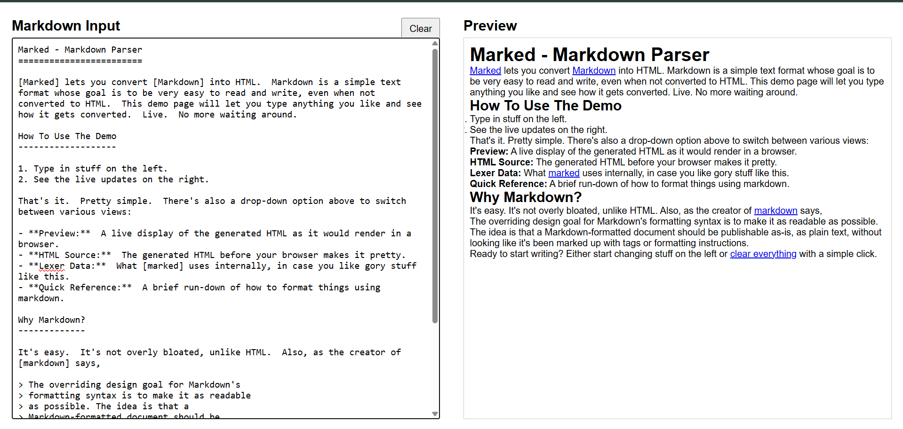

# Markdown Previewer

## Overview
A simple, interactive web application that display markdown text in a textarea into the formatted preview in real time without any extra API calls to backend. Built with HTML, CSS, and JavaScript using the Marked.js library.

## Application Features
- **Live Preview:** Instant conversion of Markdown text.
- **Clear Button:** Easily clear the input field.
- **Responsive Design:** Works seamlessly on desktop and mobile.

## Screenshots

## Deployment
View the live application:  
[Live Demo](https://markdown-previewer-gamma-five.vercel.app/)

## Getting Started
1. Clone the repository.
2. Open `index.html` in a browser.
3. Start previewing your Markdown!
